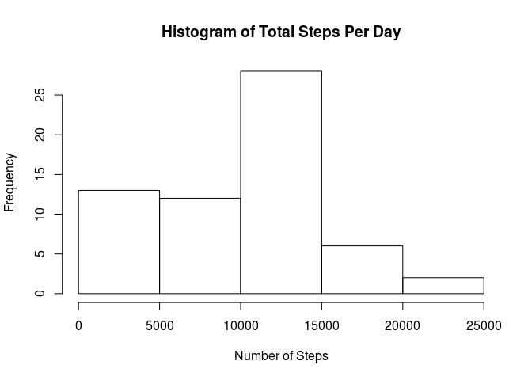
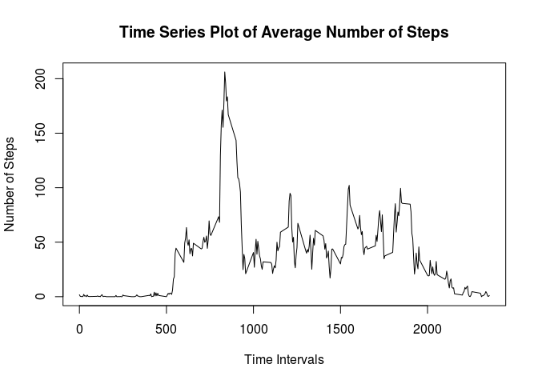
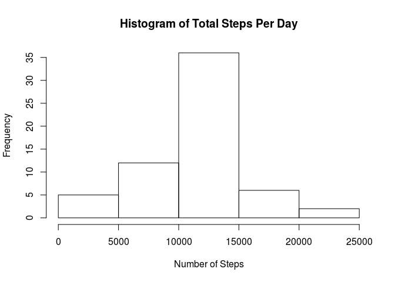
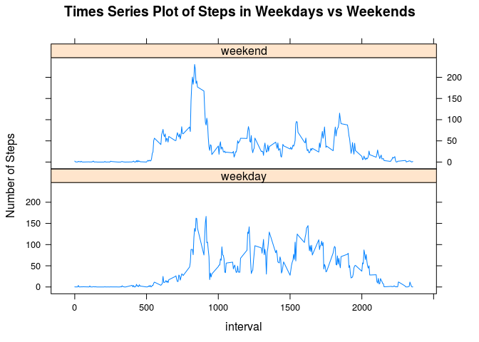

# Reproducible Research Course Project 1: Analyzing Activity Monitoring Data

## Introduction
The analysis is motivated by the growth of usage of personal activity monitoring devices. In our data set, the device collects data at 5 minute intervals through out the day. The data consists of two months of data from an anonymous individual collected during the months of October and November, 2012 and include the number of steps taken in 5 minute intervals each day.  

## Loading and preprocessing the data

```r
if(!file.exists("activity.csv")) {
  unzip("activity.zip")
}
activity <- read.csv("activity.csv")
str(activity)
```

```
## 'data.frame':	17568 obs. of  3 variables:
##  $ steps   : int  NA NA NA NA NA NA NA NA NA NA ...
##  $ date    : Factor w/ 61 levels "2012-10-01","2012-10-02",..: 1 1 1 1 1 1 1 1 1 1 ...
##  $ interval: int  0 5 10 15 20 25 30 35 40 45 ...
```

## What is the mean total number of steps taken per day?
Although the data are collected in a five-minute interval, we are more interested in the total number of steps in a daily fashion.

```r
## total number of steps per day
steps_per_day <- with(activity, tapply(steps, date, sum, na.rm = TRUE))

## histogram of steps per day
hist(steps_per_day, xlab = "Number of Steps", main = "Histogram of Total Steps Per Day")
```

<!-- -->

We could run `summary` on `steps_per_day` and obtain the statistcal estimation of the mean and median value of the number of steps per day.

```r
summary(steps_per_day, digits = 6)
```

```
##     Min.  1st Qu.   Median     Mean  3rd Qu.     Max. 
##     0.00  6778.00 10395.00  9354.23 12811.00 21194.00
```

## What is the average daily activity pattern?
It is also interesting to take a look at the time series plot of the steps in every five-minute interval across the day. In order to do this, the steps are averaged over different days,

```r
## mean steps as a function of five-minute interval
steps_5min <- with(activity, tapply(steps, interval, mean, na.rm= TRUE))
plot(names(steps_5min), steps_5min, type = "l",
     xlab = "Time Intervals", ylab = "Number of Steps",
     main = "Time Series Plot of Average Number of Steps")
```

<!-- -->

One could see a peak in the plot, which corresponds to the maximum number of steps during the day.

```r
max_steps_5min <- max(steps_5min)
names(steps_5min[steps_5min == max_steps_5min])
```

```
## [1] "835"
```

## Imputing missing values
Note that there are a number of days/intervals where there are missing values (NA) in the record of steps. The presence of missing values may introduce bias into some calculations or summaries of the data. First, let us see how values are missing. 

```r
sum(is.na(activity$steps))
```

```
## [1] 2304
```

Then, let us fill in all the missing values in the data set, using the mean for the corresponding five-minute intervals.

```r
na_or_not <- is.na(activity$steps)
interval_id <- as.factor(activity$interval[na_or_not])
activity$steps[na_or_not] <- steps_5min[interval_id]
str(activity)
```

```
## 'data.frame':	17568 obs. of  3 variables:
##  $ steps   : num  1.717 0.3396 0.1321 0.1509 0.0755 ...
##  $ date    : Factor w/ 61 levels "2012-10-01","2012-10-02",..: 1 1 1 1 1 1 1 1 1 1 ...
##  $ interval: int  0 5 10 15 20 25 30 35 40 45 ...
```

Now, there is no NAs in the steps and the data type is changed into numeric from integer. Again, let us take a look at the histogram of the total number of steps taken each day,

```r
## replot histogram of steps per day with the new clean dataset
steps_per_day <- with(activity, tapply(steps, date, sum, na.rm = TRUE))
hist(steps_per_day, xlab = "Number of Steps", main = "Histogram of Total Steps Per Day")
```

<!-- -->

and also report the mean and median steps per day.

```r
summary(steps_per_day, digits = 6)
```

```
##    Min. 1st Qu.  Median    Mean 3rd Qu.    Max. 
##    41.0  9819.0 10766.2 10766.2 12811.0 21194.0
```
Compared with the histogram of disimputed data set, The frequency of low number of steps, typically between [0 ~ 5000), has dramatically reduced. And the histogram of the new data set is more centered around the mean value. This effect is straightforward  to understand. With NAs in the original data set, sometimes we get zero or small number of entries of steps each day, which leads to the total steps per day to be zero or highly biased.

## Are there differences in activity patterns between weekdays and weekends?
It is interesting to explore the difference in pattern between weekdays and weekends. First, let us label the data set with `"weekday"` or `"weekend"` by creating a new factor variable named `weekday.or.weekend`.

```r
library(chron)
library(dplyr)
```


```r
## weekdays vs weekends
wday_or_wend <- is.weekend(as.Date(activity$date))
activity <- mutate(activity, weekday.or.weekend = wday_or_wend)
activity$weekday.or.weekend[wday_or_wend] <- "weekday"
activity$weekday.or.weekend[!wday_or_wend] <- "weekend"
head(activity)
```

```
##       steps       date interval weekday.or.weekend
## 1 1.7169811 2012-10-01        0            weekend
## 2 0.3396226 2012-10-01        5            weekend
## 3 0.1320755 2012-10-01       10            weekend
## 4 0.1509434 2012-10-01       15            weekend
## 5 0.0754717 2012-10-01       20            weekend
## 6 2.0943396 2012-10-01       25            weekend
```

Similarly, let us plot the average number of steps as a function of the time series of five-minute intervals.

```r
library(lattice)
steps_5min_wday <- aggregate(activity$steps, 
                             by = list(interval = activity$interval, 
                                       weekday.or.weekend = activity$weekday.or.weekend), 
                             FUN = mean)
xyplot(x ~ interval | weekday.or.weekend, data = steps_5min_wday, 
       type = "l", layout = c(1,2), ylab = "Number of Steps",
       main = "Times Series Plot of Steps in Weekdays vs Weekends")
```

<!-- -->

From the plot above, the time series plot of number of steps tends to fluctuate around a contant during the day of weekdays. However, in the weekend, much higher steps happens in the morning of the day, while it is depressed for the rest of the time.


